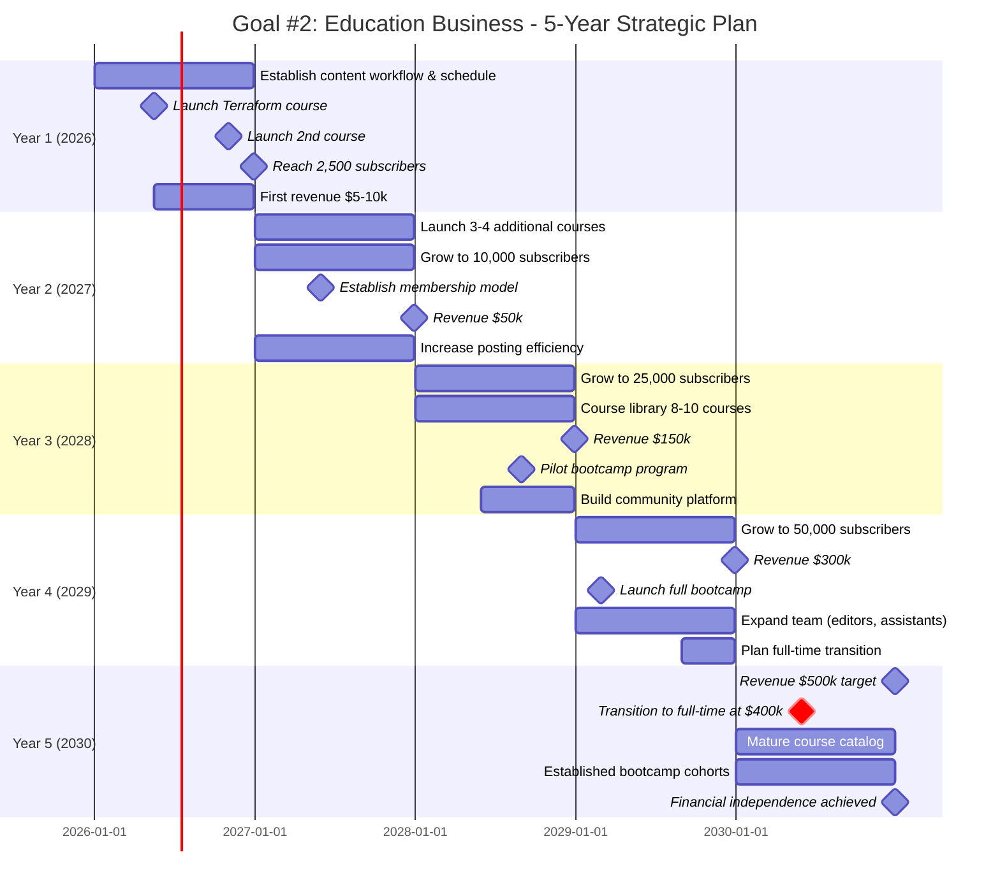
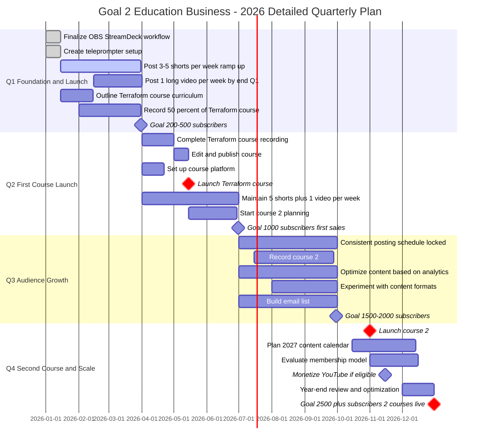

---
tags:
  - goals
---
# Goal #2: Education Business Plan

## Run a Successful Education Business

**Target**: $500,000 recurring revenue | Full-time transition at $400,000
**Timeline**: January 2026 - December 2030 (5 years)
**Weekly Time Commitment**: 10 hours initially, scaling up as business grows

---

## Executive Summary

You're building a programming education business leveraging your expertise as a principal software engineer. Starting with content creation (YouTube/TikTok) to build an audience, you'll launch online courses and eventually bootcamps. The business will supplement your income initially, then replace it when revenue hits $400,000.

---

## 5-Year Strategic Overview

### Year 1 (2026): Foundation & First Revenue

**Focus**: Establish presence, launch first courses, build audience

- Build content creation workflow and consistent posting schedule
- Launch Terraform course (Q2)
- Launch second course (Q4)
- Grow to 2,500 YouTube subscribers (free audience)
- Build email list to 1,000 subscribers
- Generate first revenue: ~$9,000 ($8k courses, $1k YouTube ads)

### Year 2 (2027): Catalog Expansion

**Focus**: Scale course offerings, introduce membership, land first sponsors

- Launch 3-4 additional courses (total 5-6 courses)
- Grow to 10,000 YouTube subscribers
- Email list: 5,000 subscribers
- Establish membership/subscription model
- Revenue breakdown: $8k YouTube ads, $10k sponsorships, $20k courses, $12k membership
- Revenue target: $50,000
- Optimize content production efficiency

### Year 3 (2028): Community Building

**Focus**: Expand to bootcamp, build community, grow all revenue streams

- Grow to 25,000 YouTube subscribers
- Email list: 15,000 subscribers
- Course library: 8-10 courses
- Revenue breakdown: $20k YouTube ads, $25k sponsorships, $40k courses, $40k membership, $25k bootcamp
- Revenue target: $150,000
- Launch pilot bootcamp program
- Build dedicated community platform

### Year 4 (2029): Team Building & Scale

**Focus**: Hire help, mature offerings, scale all channels

- Grow to 50,000 YouTube subscribers
- Email list: 35,000 subscribers
- Revenue breakdown: $35k YouTube ads, $50k sponsorships, $50k courses, $80k membership, $85k bootcamp
- Revenue target: $300,000
- Full bootcamp launch with cohorts
- Hire team members (video editors, assistants)
- Begin full-time transition planning

### Year 5 (2030): Full-Time Transition

**Focus**: Achieve independence, optimize business

- Grow to 75,000 YouTube subscribers
- Email list: 50,000+ subscribers
- Revenue breakdown: $50k YouTube ads, $75k sponsorships, $60k courses, $140k membership, $175k bootcamp
- Revenue target: $500,000
- **Transition to full-time (mid-year at $400k threshold)**
- Mature course catalog (12-15 courses)
- Established bootcamp cohorts running quarterly
- Financial independence achieved

---

## 2026 Detailed Quarterly Plan

### Q1 (January - March): FOUNDATION & LAUNCH

**Primary Objective**: Get your content machine running

**Content Creation**:

- Week 1-2: Finalize OBS, StreamDeck, and teleprompter setup
- Week 3-4: Start posting shorts (3/week), ramp to 5/week
- Week 5+: Add long-form videos (1/week by end of February)
- Practice and refine editing workflow

**Course Development**:

- Complete Terraform course curriculum outline
- Record 50% of Terraform course modules
- Set up course hosting platform (Teachable, Gumroad, or Thinkific)

**Success Metrics**:

- 200-500 YouTube subscribers (free audience)
- Posting 4-5 shorts/week + 1 video/week by end of Q1
- 50%+ of first course recorded
- Email list: 50-100 subscribers

**Weekly Time Breakdown** (10 hours):

- Content creation: 5 hours (filming shorts + 1 video)
- Editing: 2 hours
- Course development: 2 hours
- Planning/admin: 1 hour

---

### Q2 (April - June): FIRST COURSE LAUNCH

**Primary Objective**: Launch Terraform course and make first sales

**Content Creation**:

- Maintain 5 shorts/week + 1 long video/week
- Create course launch content (promotional videos)
- Begin analyzing what content performs best

**Course Development**:

- Complete Terraform course recording (early April)
- Edit and finalize all modules
- Create course landing page and sales materials
- **LAUNCH Terraform course** (target: mid-May)
- Begin planning course #2

**Marketing**:

- Email list building starts
- Course launch campaign
- Leverage YouTube community tab

**Success Metrics**:

- 1,000 YouTube subscribers (free audience)
- Terraform course launched
- First 10-20 course sales ($990-1,980 in course revenue)
- Email list: 200-300 subscribers
- YouTube watch hours: tracking toward 4,000 for monetization

**Weekly Time Breakdown** (10-12 hours):

- Content creation: 5 hours
- Editing: 2 hours
- Course work: 3 hours
- Marketing/sales: 1-2 hours

---

### Q3 (July - September): AUDIENCE GROWTH

**Primary Objective**: Lock in consistent schedule and grow audience

**Content Creation**:

- Consistent 5 shorts + 1 video/week (non-negotiable)
- Optimize based on analytics (double down on what works)
- Experiment with new formats (tutorials, live coding, Q&A)

**Course Development**:

- Choose and outline course #2 (Advanced Python or another high-demand topic)
- Record 75%+ of course #2
- Continue promoting Terraform course

**Community Building**:

- Engage with comments daily
- Build email list actively (target: 500 subscribers)
- Consider starting Discord or community platform

**Success Metrics**:

- 1,500-2,000 YouTube subscribers (free audience)
- 40-60 total course sales ($4,000-6,000 cumulative course revenue)
- Course #2: 75% complete
- Email list: 500-700 subscribers

**Weekly Time Breakdown** (12-15 hours as business grows):

- Content creation: 6 hours
- Editing: 3 hours
- Course development: 3 hours
- Community engagement: 2 hours
- Analytics/optimization: 1 hour

---

### Q4 (October - December): SECOND COURSE & SCALE

**Primary Objective**: Launch second course and hit year-end goals

**Content Creation**:

- Maintain schedule (5 shorts + 1 video/week)
- Create end-of-year recap content
- Plan 2027 content calendar

**Course Development**:

- **LAUNCH course #2** (target: early November)
- Coordinate dual-course promotions
- Evaluate membership model (is it time?)

**Business Development**:

- Monetize YouTube channel (if eligible: 1,000 subs + 4,000 watch hours)
- Year-end business review and planning
- Set up proper business entity (LLC) if revenue justifies it
- Plan 2027 course roadmap

**Success Metrics**:

- **2,500+ YouTube subscribers** (free audience) ✓
- **2 courses launched** ✓
- 80-120 total course sales ($8,000-12,000 cumulative course revenue)
- Email list: 1,000+ subscribers
- YouTube monetization enabled (1,000 subs + 4,000 watch hours met)
- First YouTube ad revenue: $200-500
- Total Year 1 revenue: ~$9,000 (courses + YouTube ads)

**Weekly Time Breakdown** (15+ hours):

- Content creation: 6 hours
- Editing: 3 hours
- Course/business development: 4 hours
- Marketing/community: 2 hours

---

## Revenue Projection Path to $500k

**Key Metrics to Track**:

- **YouTube Subscribers** (free audience) → drives ad revenue & sponsorships
- **Email List Subscribers** (potential customers) → conversion funnel
- **Paying Customers** → actual revenue
- **Conversion Rate**: 2-5% of email list typically converts to paying customers

**Revenue Streams**:

1. **YouTube Monetization**: Ad revenue from views (CPM varies $2-10)
2. **Sponsorships/Brand Deals**: Paid promotions in videos
3. **Course Sales**: One-time purchases @ $99 average
4. **Membership/Subscription**: Recurring monthly @ $49-99/month
5. **Bootcamp**: High-ticket @ $2,000-4,000 per student

**Year-by-Year Revenue Model**:

|Year|YouTube Subs|Email List|Courses Available|YouTube Ads|Sponsorships|Course Sales|Membership|Bootcamp|**Total Revenue**|
|---|---|---|---|---|---|---|---|---|---|
|2026|2,500|1,000|2|$1k|$0|$8k|$0|$0|**$9k**|
|2027|10,000|5,000|6|$8k|$10k|$20k|$12k|$0|**$50k**|
|2028|25,000|15,000|10|$20k|$25k|$40k|$40k|$25k|**$150k**|
|2029|50,000|35,000|12|$35k|$50k|$50k|$80k|$85k|**$300k**|
|2030|75,000|50,000|15|$50k|$75k|$60k|$140k|$175k|**$500k**|

**Detailed Breakdown by Revenue Type**:

**YouTube Monetization** (Passive income from content):

- Year 1: Monetization enabled ~Q4 (~1M views @ $1 CPM = $1k)
- Year 2: ~4M views @ $2 CPM = $8k
- Year 3: ~10M views @ $2 CPM = $20k
- Year 4+: Higher CPM as audience matures + more views

**Sponsorships/Brand Deals**:

- Year 1: None (building audience)
- Year 2: 2-3 small deals @ $3-5k each
- Year 3+: Regular sponsors, affiliate deals, course platform partnerships

**Platform Revenue** (Your direct business):

- **Course Sales**: One-time purchases, grows with catalog size
- **Membership**: Recurring revenue, starts Year 2 when you have 5+ courses
    - Year 2: ~20 members @ $49/month
    - Year 5: ~200 members @ $70/month average
- **Bootcamp**: High-ticket, starts Year 3
    - Year 3: 10-15 students @ ~$2,500
    - Year 5: 50-60 students @ ~$3,000 (multiple cohorts)

**Key Insight**: YouTube subscribers are your top-of-funnel audience. Email list is middle-of-funnel. Paying customers are bottom-of-funnel. A healthy conversion path looks like:

- 1,000 YouTube subs → ~200 email subscribers → ~10 paying customers (1% overall conversion)
- As you mature: Better conversion rates through trust, proven results, optimized funnels

---

## Key Success Factors

### 1. **Consistency is King**

- The most important metric in Year 1 is showing up every week
- Your workflow must become effortless and sustainable
- Quality will improve naturally with practice

### 2. **Understand Your Funnel**

- **YouTube subscribers** = Top of funnel (free audience, drives ad revenue)
- **Email list** = Middle of funnel (potential customers)
- **Paying customers** = Bottom of funnel (actual revenue)
- Optimize each stage: Get more YouTube subs → convert more to email → convert more to customers

### 3. **Maximize YouTube Monetization**

- **Requirements**: 1,000 subscribers + 4,000 watch hours in 12 months
- **Strategy**: Focus on watch time, not just views (longer videos help)
- **CPM varies**: $2-10 depending on niche (tech/programming typically $4-8)
- **Sponsorships unlock** at ~5,000-10,000 subscribers ($500-5,000 per video)
- **Affiliate deals**: Promote tools you use (AWS, course platforms, etc.)

### 4. **Audience Before Sales**

- Don't rush monetization
- Build trust and provide value first
- Your audience size directly correlates to revenue across ALL streams

### 5. **Lean Into What Works**

- Pay close attention to analytics (watch time, CTR, retention)
- Double down on successful content formats
- Don't be afraid to pivot away from what doesn't resonate

### 6. **Build in Public**

- Share your learning journey
- Document your software engineering experiences
- Authenticity builds loyal audiences

### 7. **Product Ladder Strategy**

- Free content (YouTube) → Email list → $99 courses → $49-99/month membership → $2-4k bootcamp
- Each step increases commitment and value
- YouTube monetization provides passive income baseline

---

## Critical Milestones & Decision Points

### Quarter 2, 2026: First Launch Assessment

**Decision**: Did the Terraform course launch successfully?

- If YES: Continue with plan, launch course #2
- If NO: Analyze what went wrong, adjust course topic or marketing approach

### Quarter 4, 2026: Year-End Review

**Decision**: Did you hit 2,500 subscribers and launch 2 courses?

- If YES: Proceed to Year 2 plan with confidence
- If NO: Assess barriers (time commitment, content quality, topic selection)

### Quarter 2, 2027: Membership Model Decision

**Decision**: Is it time to introduce membership/subscription?

- Requires: 5+ courses, 5,000+ email subscribers, proven demand
- Consider: Platform costs, ongoing content obligations

### Quarter 4, 2028: Full-Time Preparation

**Decision**: On track for $400k by 2030?

- If YES: Begin transition planning (savings, benefits, workload shift)
- If NO: Identify growth levers (marketing, new products, pricing)

### Mid-2030: The Transition

**Decision**: Revenue hits $400k - go full-time?

- Ensure: 6 months operating expenses saved, stable recurring revenue
- Plan: Transition timeline with current employer, insurance, retirement accounts

---

## Risk Mitigation

### Risk 1: Burnout from dual commitments

**Mitigation**:

- Batch content creation (record multiple videos in one session)
- Outsource editing once revenue supports it ($500-1,000/month)
- Take strategic breaks without breaking posting schedule (use scheduled posts)

### Risk 2: Slow audience growth

**Mitigation**:

- Focus on SEO and searchable content (tutorials, how-to's)
- Collaborate with other creators in your niche
- Paid promotion once proven content converts ($500-1,000 test budget)

### Risk 3: Course sales don't materialize

**Mitigation**:

- Validate course topics with audience surveys before building
- Offer early-bird pricing to generate initial momentum
- Build email list aggressively (lead magnets, free mini-courses)

### Risk 4: Technology/platform changes

**Mitigation**:

- Don't rely on single platform (YouTube + email list + your own site)
- Own your audience (email list is yours, not platform's)
- Diversify content across platforms (YouTube, TikTok, LinkedIn)

---

## Tools & Resources Needed

### Content Creation (Already Have):

- OBS Studio
- Stream Deck
- Teleprompter solution
- Video editing software

### Course Hosting ($29-199/month):

- Teachable, Thinkific, or Gumroad
- Start with Gumroad (simplest) or Teachable (most features)

### Email Marketing ($0-50/month initially):

- ConvertKit, MailerLite, or Beehiiv
- Start free tier, upgrade as list grows

### Community (Optional Year 1, Important Year 2+):

- Discord (free)
- Circle or Mighty Networks ($39-79/month)

### Analytics:

- YouTube Studio (free)
- Google Analytics (free)
- TubeBuddy or VidIQ for YouTube optimization ($0-39/month)

**Estimated Monthly Tool Costs**:

- Year 1: $30-100/month
- Year 2: $100-200/month
- Year 3+: $200-500/month (as you add team tools)

---

## Action Items for January 2026

**Week 1** (This Week):

- [ ] Finalize teleprompter solution and test it
- [ ] Create content calendar for January (topics for 4 videos + 20 shorts)
- [ ] Set up Gumroad account for future course sales
- [ ] Create Terraform course outline (module list, learning objectives)

**Week 2**:

- [ ] Record and publish first 3 shorts
- [ ] Script and record first long-form video
- [ ] Begin recording Terraform course module 1
- [ ] Set up email capture on YouTube (link in description)

**Week 3**:

- [ ] Publish first long-form video
- [ ] Post 5 shorts this week
- [ ] Record Terraform modules 2-3
- [ ] Research email marketing tools, choose one

**Week 4**:

- [ ] Maintain 5 shorts + 1 video schedule
- [ ] Record Terraform modules 4-5
- [ ] Review analytics from first month
- [ ] Plan February content

---

## Monthly Check-In Template

Use this monthly to track progress:

**Month: ___________**

**Content Metrics**:

- Shorts posted: ___/20 (target: 20)
- Videos posted: ___/4 (target: 4)
- Total views: _____
- Watch hours: _____ (tracking toward 4,000 for monetization)
- New YouTube subscribers: _____
- Total YouTube subscribers: _____

**Audience Growth**:

- New email subscribers: _____
- Total email subscribers: _____
- Email → customer conversion rate: _____%

**Course Progress**:

- Course #1 progress: ____%
- Course #2 progress: ____%
- Sales this month: _____
- Total paying customers: _____

**Revenue This Month**:

- YouTube ad revenue: $_____
- Sponsorships: $_____
- Course sales: $_____
- Membership: $_____
- **Total: $_____**

**Time Invested**:

- Hours this month: _____
- Average per week: _____

## **Wins**:

## **Challenges**:

## **Next Month Focus**:

---

## Final Thoughts

This plan is ambitious but achievable with consistent effort. The key is building momentum in 2026 that compounds over the next 5 years. Your existing expertise as a principal software engineer gives you credibility and valuable knowledge to share.

Remember: **You're not building courses, you're building a media company that happens to sell education products.**

Your weekly content is the engine. Courses are the fuel. The audience is the destination.

Stay consistent, track your metrics, and adjust as you learn what resonates with your audience.

**When revenue hits $400k, you'll have the confidence to make the leap to full-time entrepreneurship while achieving Goal #3 (financial independence) simultaneously.**

Let's make this happen! 🚀

[[5 Year Goals]]