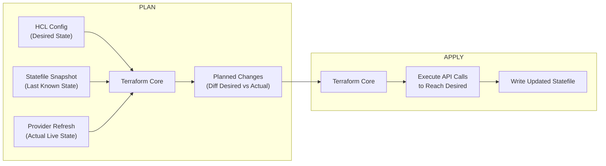
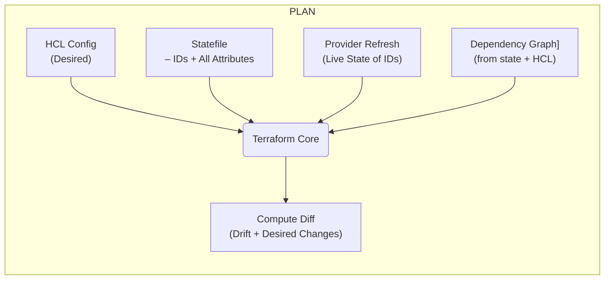
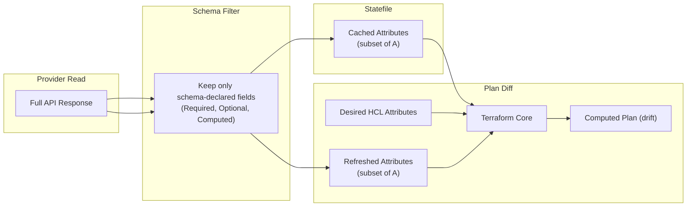
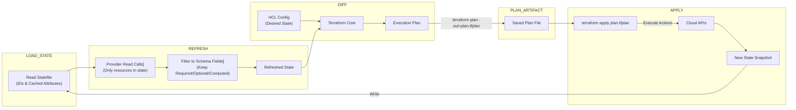

Act as if you are a maintainer on the Terraform project. In Terraform there are three different kinds of state. The desired state in Terraform files, the actual state in the cloud and the statefile. What exactly is the statefile used for? Can you diagram the flow of information during the plan and apply?

###### ChatGPT said:

Thought for 4 seconds

In Terraform, the **statefile** (by default `terraform.tfstate`) is a critical piece of Terraform’s architecture. It is **not** the “source of truth” for your desired configuration (that’s your HCL files), nor is it the actual live state in the cloud (that lives in your provider). Instead, the statefile is **Terraform’s local (or remote) cache** of what it _last knew_ about your infrastructure.

---

### Why Terraform Needs a Statefile

1. **Resource Mapping**  
    Every resource in Terraform HCL has a corresponding real‐world object (e.g. an AWS EC2 instance). The statefile stores each resource’s provider‑given ID, so Terraform knows which real object to update or destroy on subsequent runs.
    
2. **Performance & API Efficiency**  
    Without state, Terraform would have to list _all_ your resources every time to figure out what exists. By caching known state, Terraform limits API calls to only what’s necessary to detect drift or to plan/apply changes.
    
3. **Dependency Graph & Metadata**  
    Terraform tracks dependencies (e.g. “this subnet must be created before that instance”). State holds computed attributes (like the VPC ID assigned by AWS) so downstream resources can consume them.
    
4. **Plan/Apply Accuracy**
    
    - **Plan** compares your _desired_ HCL, the _cached_ statefile, and the _actual_ live state (via provider refresh) to compute exactly what needs to change.
        
    - **Apply** executes only the necessary API calls, then writes the _new_ state back to the file so the next run sees the updated snapshot.
        

_For an in‑depth overview see the Terraform docs on state →_  
https://developer.hashicorp.com/terraform/language/state

---

### Typical Backend Configuration Example

You can store your state remotely (e.g. in S3) to enable collaboration and locking:

```hcl
terraform {
  backend "s3" {
    bucket         = "my-terraform-state"
    key            = "envs/prod/terraform.tfstate"
    region         = "us-east-1"
    dynamodb_table = "terraform-state-lock"
  }
}
```

This tells Terraform to read/write its statefile from an S3 object and coordinate locks via DynamoDB.

---

### Flow of Information During `terraform plan` and `terraform apply`




1. **Plan**
    
    - **Load** your HCL configuration (what you _want_).
        
    - **Read** the last‐known statefile (what Terraform _thinks_ exists).
        
    - **Refresh** by querying the provider to get the actual live state (what _really_ exists).
        
    - **Diff** actual vs. desired → produce the plan.
        
2. **Apply**
    
    - **Execute** only the actions in the plan (create, update, destroy).
        
    - **Update** the statefile with any new IDs, attributes, and metadata.
        

---

### Quick Commands for Inspecting State

```bash
# List all tracked resources
terraform state list

# Show attributes of a specific resource
terraform state show aws_instance.my_server

# Remove a resource from state without destroying it
terraform state rm aws_instance.old_server
```

---

**Key Takeaway:** the statefile is **not** your master configuration nor the live cloud state, but rather Terraform’s **source of truth about what it last applied**, enabling accurate diffs, efficient API usage, and reliable orchestration of your infrastructure.

o4-mini

##### You said:

In generating a plan it seems that the only thing the statefile would be used for is know which IDs Terraform thinks that it owns. Is there something else going on there?

###### ChatGPT said:

Thought for a few seconds

You’re right that at its simplest the statefile’s most obvious job is to remember “this resource in your HCL corresponds to that cloud‐provider ID,” but it’s actually doing a lot more under the hood. Here are the other key pieces of information Terraform persists in state, and how they matter during a `plan`:

---

## 1. Full Resource Attribute Cache

Beyond the `id` field, Terraform stores **all** the attributes it last saw for each resource:

```json
{
    "address": "aws_instance.web",
    "mode": "managed",
    "type": "aws_instance",
    "name": "web",
    "provider_name": "registry.terraform.io/hashicorp/aws",
    "instances": [
        {
            "schema_version": 1,
            "attributes": {
                "id": "i-0abcd1234efgh5678",
                "ami": "ami-0abcdef1234567890",
                "instance_type": "t3.small",
                "tags": {
                    "Name": "web-server"
                },
                …
            }
        }
    ]
}
```

– **Why it matters:**  
– On `plan`, Terraform needs these cached attributes to do two things:  
1. Populate expressions (`${aws_instance.web.public_ip}`) without re‑querying the provider for every single field.  
2. Determine which attributes have _actually_ drifted versus what you’re asking for in your HCL.  
– Without the attribute cache, Terraform would need to do a full `DescribeInstances` (or equivalent) of _every_ resource to discover attribute values—and then diff those back to itself—every single run.

---

## 2. Instance Keying for `count` / `for_each`

When you use `count` or `for_each`, Terraform needs a stable way to track which instance is which. The statefile holds the **index → ID** or **key → ID** mapping:

```hcl
resource "aws_ebs_volume" "data" {
    for_each = { “db”: 1, “cache”: 2 }

    size = each.value
}
```

In state you’ll see:

```json
"instances": [
    {
        "index_key": "db",
        "attributes": {
            "id": "vol-01..."
        }
    },
    {
        "index_key": "cache",
        "attributes": {
            "id": "vol-02..."
        }
    }
]
```

– **Why it matters:** Terraform uses that mapping on plan to know **which** volume to update or destroy when you change the map or the count.

---

## 3. Dependency Graph Metadata

Terraform builds a graph of resource dependencies (from implicit references and `depends_on`). It persists enough information in state so that on the next run it can:

1. **Quickly reconstruct** the graph without re‑scanning all your HCL.  
2. **Retain any custom ordering** you might’ve injected with `depends_on`.

---

## 4. Provider & Module Lineage

State includes the Terraform **version**, the **backend lineage ID**, and the **provider versions** used when the state was created or last upgraded:

```json
"terraform_version": "1.5.0",
"lineage": "abcd1234-5678-90ef-ghij-klmnopqrstuv",
"provider": [
    {
        "name": "registry.terraform.io/hashicorp/aws",
        "version": "4.50.0"
    } 
]
```

– **Why it matters:**—for example, when you `terraform init -upgrade` or migrate a state, Terraform can detect incompatible changes in provider schemas or backend lineage mismatches.

---

## 5. Outputs & Sensitive Values

Any `output` values you’ve declared (and marked `sensitive`) get stored in state so that other modules or your CI/CD can consume them without re‑running apply.

---

## 6. Tainted / Deprioritized Flags

If you or Terraform mark a resource as `tainted` (forcing replacement), that flag lives in state until the next apply. Likewise, any partial failure metadata.

---

### Putting It All Together: Enhanced Plan Flow



1. **Read** your HCL (what you want).
    
2. **Load** the last‑known state (all cached attributes, IDs, dependency hints, provider versions, outputs) instead of re‑querying everything.
    
3. **Refresh** only the attributes Terraform needs to validate drift on (it knows which attributes matter because it has the full attribute cache).
    
4. **Reconstruct** the dependency graph quickly (using state + HCL).
    
5. **Diff** refreshed live state vs. desired state → generate plan.
    

---

## Further Reading

- Terraform State Overview:  
    https://developer.hashicorp.com/terraform/language/state
    
- How Terraform Caches Attributes under the Hood:  
    [https://github.com/hashicorp/terraform/blob/main/…/state/statefile/stateschema.json](https://github.com/hashicorp/terraform/blob/main/%E2%80%A6/state/statefile/stateschema.json)
    

o4-mini

##### You said:

How are only a subset of variables needed to detect drive?

###### ChatGPT said:

Thought for 19 seconds

Terraform doesn’t need to track every single property the cloud API returns—instead, **only the attributes you’ve declared (or marked “Computed”) in your provider schema** are stored in state and diffed for drift. Here’s how that works under the hood:

1. **Schema‑driven attribute filtering**  
    Every resource in a Terraform provider has a Go‑level schema that declares exactly which fields to care about:
    
    - **Required** or **Optional** fields are those you can (or must) configure in HCL.
        
    - **Computed** fields are ones only the provider knows (e.g. UUIDs, IP addresses).  
        Terraform will only store these schema‑declared fields in the statefile. Anything else the API returns (logs, metrics, undocumented flags) is simply dropped. [HashiCorp Developer](https://developer.hashicorp.com/terraform/plugin/sdkv2/schemas/schema-behaviors)
        
2. **Caching only what you care about**  
    When you run `terraform refresh` (implicitly before `plan`), Terraform’s plugin calls the provider’s Read/GET operation, which usually returns the full resource. The provider code then:
    
    - **Filters** that response down to the schema fields.
        
    - **Updates** only those attributes in the state.  
        This keeps refresh‐time and statefile size under control—Terraform never polls or stores irrelevant fields. [HashiCorp | An IBM Company](https://www.hashicorp.com/en/blog/detecting-and-managing-drift-with-terraform)
        
3. **Diff‑time uses just those fields**  
    During `terraform plan`, Terraform compares:
    
    - The **desired** attributes (what you wrote in HCL),
        
    - The **cached** attributes (what’s in the statefile), and
        
    - The **refreshed** values (what the provider just returned for those same schema fields).  
        Since only schema fields ever enter the state, only that subset gets diffed.
        
4. **Suppressing drift on specific attributes**  
    If there are schema fields that you really don’t care about drifting—say the provider always returns timestamps in UTC vs. your local TZ—you can use `DiffSuppressFunc` on the schema or `lifecycle { ignore_changes = [...] }` in your HCL. Those modifiers tell Terraform “even if this field changes, don’t mark it as drift.”
    

---

### Diagram of how Terraform narrows its focus to a subset of attributes



1. **Provider Read** fetches the full resource.
    
2. **Schema Filter** drops all un‑declared fields, keeping only those Terraform knows about.
    
3. **Statefile** holds the last known values of those schema fields.
    
4. **Plan Diff** compares your HCL (D) and the freshly read values (E) against the cached state (C) to surface drift (G).
    

---

**Key takeaway:** Terraform’s statefile—and by extension its drift detection—only involves the specific attributes you’ve told it to manage, not every property in the cloud resource. This schema‑driven approach keeps plans efficient and focused on what really matters to your infrastructure.


Sources

o4-mini

##### You said:

When planning how is the statefile considered? If a plan is just the diff between the desired and actual state, how does the plan fit in?

###### ChatGPT said:

Thought for 9 seconds

When you run `terraform plan`, Terraform isn’t doing a simple two‑way diff of your HCL versus the live cloud; it’s doing a **three‑way comparison** that involves your **statefile** as the pivot. Here’s how it all fits together:

1. **Load the Last‑Known State**  
    Terraform first reads your statefile (local or remote). This gives Terraform the IDs and the last‑cached attribute values of each resource it “owns.” Without this, Terraform wouldn’t know which existing objects in the cloud map to which resources in your configuration [HashiCorp Developer](https://developer.hashicorp.com/terraform/language/state?utm_source=chatgpt.com).
    
2. **Refresh to Actual Live State**  
    Next, Terraform invokes each provider’s **Read** (or GET) operation on only the resources recorded in your statefile. The provider returns the current live attributes, but Terraform immediately filters that through its provider schema, keeping only the fields marked **Required**, **Optional**, or **Computed**. The result is a refreshed snapshot of “what really exists” for just those managed resources.
    
3. **Reconcile and Diff**  
    With both the **desired** configuration (your HCL) and the **refreshed** state (from step 2), Terraform Core computes:
    
    `Planned Changes = Desired HCL  –  Refreshed State`
    
    It does **not** compare HCL directly against the cloud for every attribute—only the schema‑declared subset you actually manage. And it uses the statefile’s cached values to know when an attribute has truly drifted versus simply changed in-memory.
    
4. **Plan as an Artifact**  
    By default, `terraform plan` prints this set of proposed actions (create/update/delete) to your terminal. If you pass `-out=plan.tfplan`, Terraform serializes that plan—along with a fingerprint of the statefile lineage and provider versions—into a binary plan file. That file can later be passed to `terraform apply` to ensure you’re applying exactly what you reviewed, without another refresh [HashiCorp Developer](https://developer.hashicorp.com/terraform/cli/commands/plan?utm_source=chatgpt.com).
    
5. **Apply Uses the Plan + State**  
    When you run `terraform apply plan.tfplan`, Terraform:
    
    - Verifies the **state lineage** matches what the plan expected.
        
    - Skips another full refresh (it trusts the plan).
        
    - Executes the exact actions in the plan.
        
    - **Finally** writes an updated statefile snapshot reflecting the new reality.
        

---

### Mermaid Diagram: Plan Flow with the Statefile as Pivot



- **LOAD_STATE**: Statefile tells Terraform what resources to manage and how they were last configured.
    
- **REFRESH**: Only those resources are queried, and only their schema‑declared attributes are considered.
    
- **DIFF**: Desired vs. refreshed → build the plan in memory.
    
- **PLAN_ARTIFACT**: Optionally persist the plan for review or automation.
    
- **APPLY**: Reuse the plan, execute exactly those changes, then update the statefile.
    

---

**Bottom line:** the statefile is your “memory” of past applies. Terraform uses it both to know _what_ to refresh and _what_ to diff against your HCL, producing a precise plan that you can review or save before making any changes.
