## Types of state

1. Terraform Code - desired state
2. Statefile - cached state / last known
3. Cloud provider - actual current state

## Statefile Uses

1. Resource mapping - map the Terraform address to a managed resource
2. Caching - reduce the number of API calls required in many cases
3. Dependency mapping - tracks dependencies and computed resource attributes used by downstream resources


```hcl
resource "type" "name" {
  attribute = "value"
}
```

Address: `type.name`

```mermaid
---
config:
  layout: elk
  look: handDrawn
  theme: neutral
  elk:
    mergeEdges: true
    nodePlacementStrategy: LINEAR_SEGMENTS
---
flowchart LR
  subgraph LOAD_STATE
    S1["Read Statefile<br/>(IDs & Cached Attributes)"]
  end
  subgraph REFRESH
    S1 --> P1["Provider Read Calls<br/>(Only resources in state)"]
    P1 --> S2["Filter to Schema Fields<br/>(Keep Required/Optional/Computed)"]
    S2 --> R1[Refreshed State]
  end
  subgraph DIFF
    C1["HCL Config<br/>(Desired State)"]
    R1[Refreshed State]
    C1 --> T1[Terraform Core]
    R1 --> T1
    T1 --> Plan[Execution Plan]
  end
  subgraph PLAN_ARTIFACT
    Plan --> |"`terraform plan -out=plan.tfplan`"| PF[Saved Plan File]
  end
  subgraph APPLY
    PF --> Apply[terraform apply plan.tfplan]
    Apply --> |Execute Actions| Cloud[Cloud APIs]
    Cloud --> NewState[New State Snapshot]
    NewState --> |Write| S1
  end

```



## Thoughts
* Research the attribute schema (required, optional, computed)
* Drift detected (error message in the plan)
* Statefile only updates
